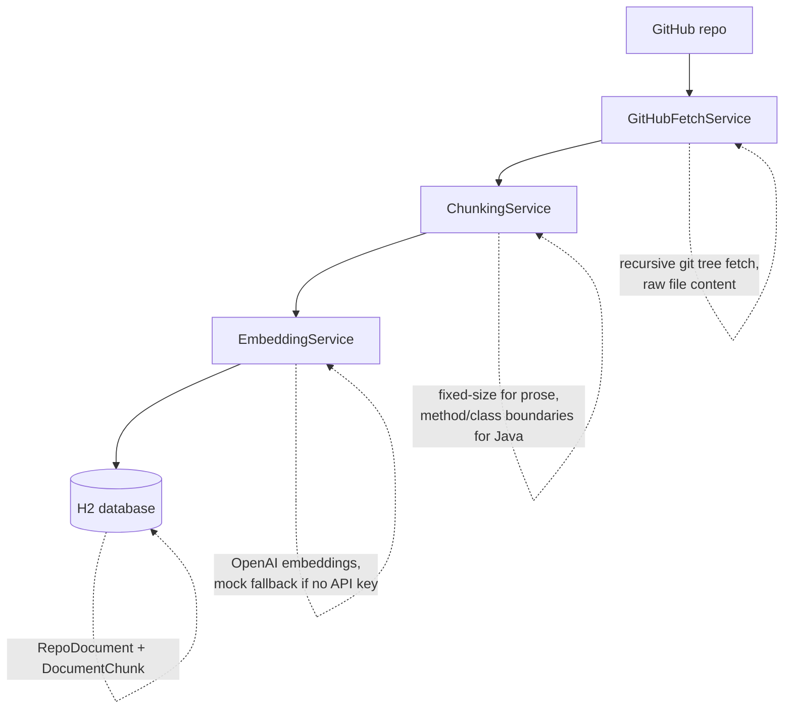
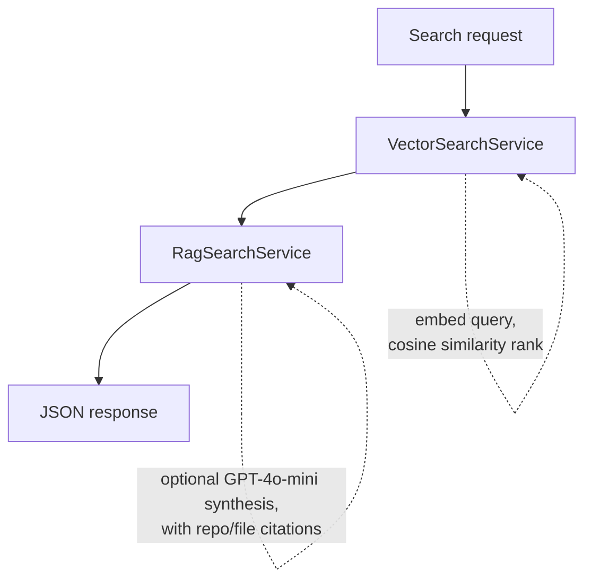
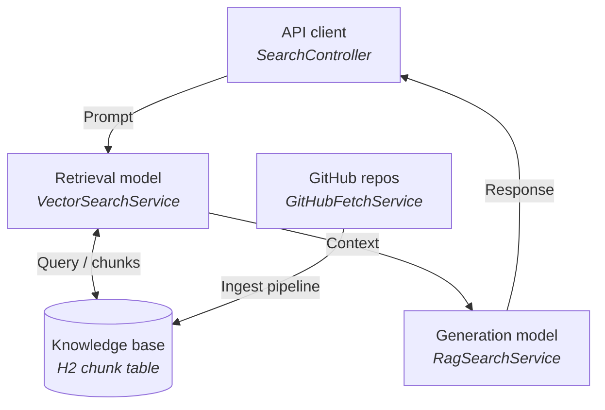

# RAG GitHub Search

A Retrieval-Augmented Generation (RAG) system, built from scratch in Java, that lets you semantically search and ask questions about your own GitHub repositories.

It pulls files from a GitHub repo, chunks them, embeds them with OpenAI, stores them in a database, and answers natural-language questions by retrieving relevant chunks and optionally synthesizing a cited answer with GPT.

## What it does

1. **Ingest** — point it at a GitHub username/repo. It fetches every README, source file, and config file, splits them into chunks (prose gets fixed-size chunking, Java code gets split on method/class boundaries), embeds each chunk, and stores everything in a database.
2. **Search** — ask a question. It embeds your query, ranks stored chunks by cosine similarity, and optionally asks GPT-4o-mini to synthesize a direct answer, citing which repo and file each part came from.

## Architecture

### Ingestion flow



### Search flow



### Mapped to the classic RAG framework



## Tech stack

| Layer | Choice |
|---|---|
| Language | Java 17 |
| Framework | Spring Boot 3.2 |
| Build tool | Maven |
| Web/HTTP client | Spring WebFlux `WebClient` (for GitHub + OpenAI calls) |
| Persistence | Spring Data JPA + H2 (in-memory, swappable for Postgres/pgvector) |
| Embeddings | OpenAI `text-embedding-3-small`, with a deterministic mock fallback when no API key is set |
| Answer synthesis | OpenAI `gpt-4o-mini` |
| Boilerplate | Lombok |

No agentic framework, no vector database, no orchestration library — this is a fixed, linear RAG pipeline written directly against Spring Boot and the OpenAI REST API, built as a learning project to understand RAG mechanics from first principles rather than through a framework like LangChain.

## Project structure

```
src/main/java/com/githubrag/
├── controller/          REST endpoints (IngestController, SearchController)
├── service/
│   ├── github/          Fetches repos, file trees, and raw content from GitHub
│   ├── ingestion/        Chunking + orchestrates fetch → chunk → embed → persist
│   ├── embedding/        OpenAI embeddings, with mock fallback
│   └── search/           Cosine similarity ranking + RAG answer synthesis
├── model/
│   ├── entity/           RepoDocument, DocumentChunk (JPA entities)
│   └── dto/               Request/response shapes
├── repository/           Spring Data JPA repositories
├── config/               WebClient beans, app properties
├── exception/            Centralized error handling (@ControllerAdvice)
└── util/                 Cosine similarity, file type resolution
```

## API

### `POST /api/v1/repos/ingest`
Fetches and indexes a GitHub repo.

```json
{
  "repoName": "rag-github-search",
  "forceRefresh": false
}
```

### `POST /api/v1/search`
Semantic search with optional answer synthesis.

```json
{
  "query": "how does chunking work",
  "topK": 3,
  "generateAnswer": true
}
```

### `GET /api/v1/search`
Same as above via query params: `?q=...&topK=3&generateAnswer=true`

## Running it locally

**Prerequisites:** JDK 17, Maven, and (optionally) an OpenAI API key with billing enabled.

```bash
git clone https://github.com/Yuti2908/RAG-Github-Search.git
cd RAG-Github-Search
```

Set your OpenAI key as an environment variable (never commit it to a file):

```bash
# macOS/Linux
export OPENAI_API_KEY="sk-..."

# Windows PowerShell
[Environment]::SetEnvironmentVariable('OPENAI_API_KEY', 'sk-...', 'User')
```

Without a key set, the app still runs fully — `EmbeddingService` and `RagSearchService` fall back to deterministic mock behavior, which is enough to test the pipeline end-to-end without incurring any API cost.

Build and run:

```bash
mvn clean compile
mvn spring-boot:run
```

The app starts on `http://localhost:8080`. Try it:

```bash
curl -X POST http://localhost:8080/api/v1/repos/ingest \
  -H "Content-Type: application/json" \
  -d '{"repoName": "RAG-Github-Search"}'

curl -X POST http://localhost:8080/api/v1/search \
  -H "Content-Type: application/json" \
  -d '{"query": "how does chunking work", "topK": 3, "generateAnswer": true}'
```
## Chunking strategy

Different content types get split differently, since a one-size-fits-all approach breaks code and wastes context on prose:

- **Prose (README, Markdown)** — fixed-size chunking: 500 characters per chunk, with a 50-character overlap between consecutive chunks so context isn't lost at a boundary.
- **Java source files** — split on method and class boundaries using a regex-based approximation (not a full AST parser). Each chunk is one full method or class body, so a function is never cut in half mid-logic. Anything before the first boundary (package declaration, imports, field declarations) becomes its own leading chunk.
- **Everything else** (other code files, config, etc.) — falls back to the same fixed-size strategy used for prose.

This means a chunk from `EmbeddingServiceImpl.java` is a complete method, while a chunk from `README.md` is a 500-character window of text — each retrieved independently and ranked by similarity at search time.

### Why chunk differently per type

- **Keeps retrieval meaningful** — a chunk that's half a method signature and half unrelated code below it produces a garbage embedding; keeping method/class boundaries intact means each chunk represents one coherent unit of logic.
- **Improves answer quality** — when `RagSearchService` builds context for GPT, a complete method is far more useful than an arbitrary character-count slice cutting through the middle of it.
- **Avoids wasted embeddings** — over-chunking prose (e.g. per-sentence) creates many near-duplicate vectors and drives up embedding cost for no retrieval benefit; 500-character windows are a reasonable middle ground of granularity vs. cost.
- **Makes citations trustworthy** — since each chunk maps back to one `RepoDocument` (file) and stays semantically self-contained, the `(repo: ..., file: ...)` citations in synthesized answers actually point to something coherent, not a fragment spanning two unrelated ideas.

  
## Known limitations

- Unauthenticated GitHub API calls are capped at 60 requests/hour — fine for occasional ingestion, but will need a personal access token for heavier use.
- The Java chunking strategy uses a regex approximation for method/class boundaries, not a real AST parser — it can misfire on unusual formatting or heavily generic signatures.
- H2 is in-memory — data does not persist across restarts. Swap in Postgres + pgvector for anything beyond local testing.
- Cosine similarity is computed brute-force, in-memory, over all matching chunks. Fine at this scale; would need a proper vector index (pgvector, Pinecone, Qdrant) to scale further.

## Roadmap

- [ ] Accept an arbitrary GitHub username/repo at ingest time, not just a pre-configured one
- [ ] Swap H2 for Postgres + pgvector
- [ ] Add a small evaluation set to measure retrieval quality
- [ ] Re-ranking step before synthesis
- [ ] Async ingestion for larger repos
